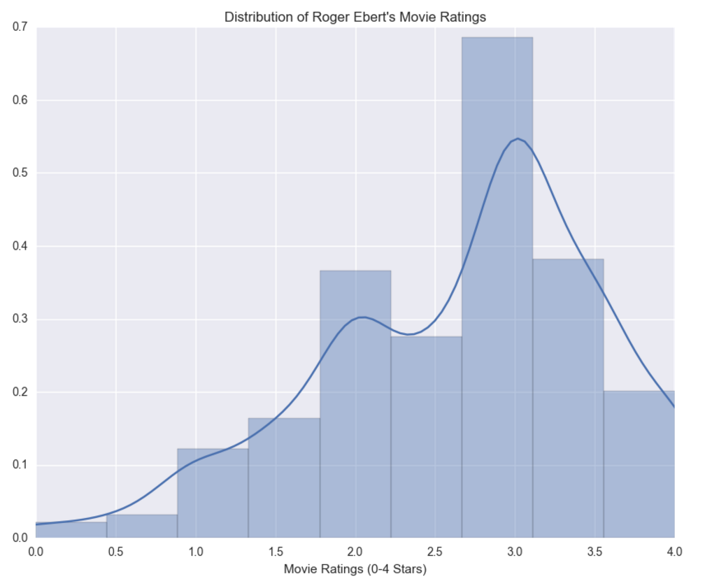
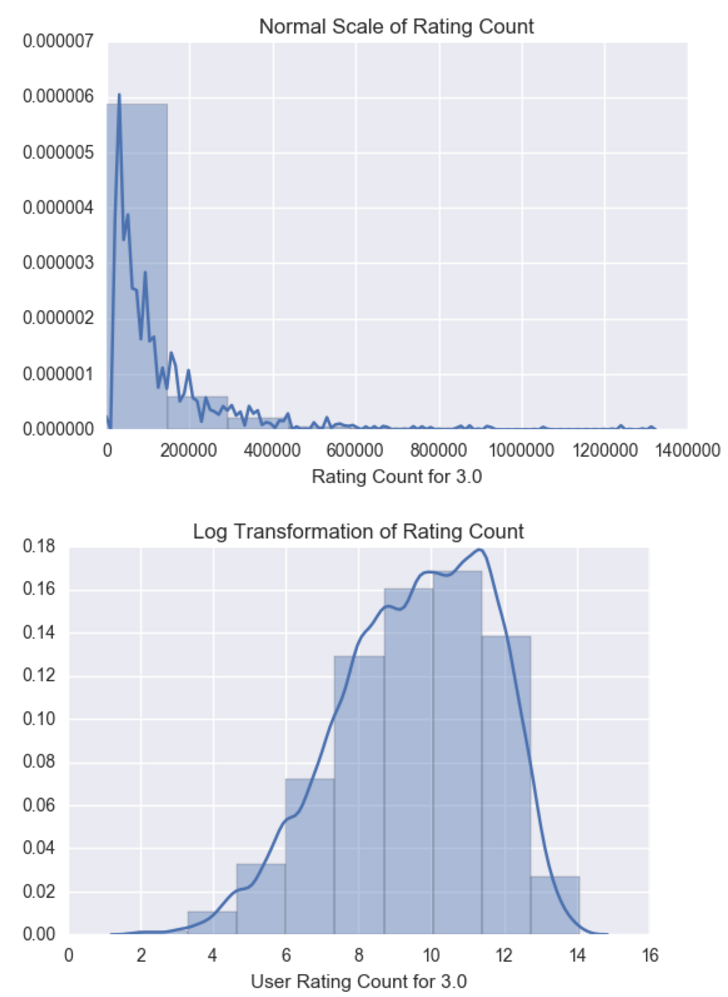
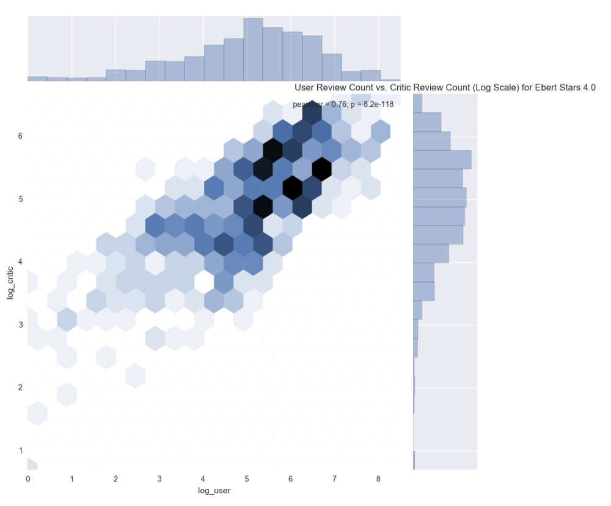
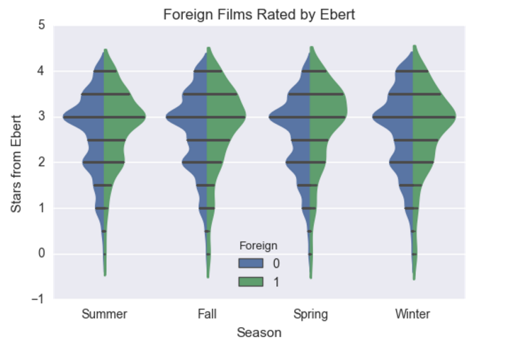
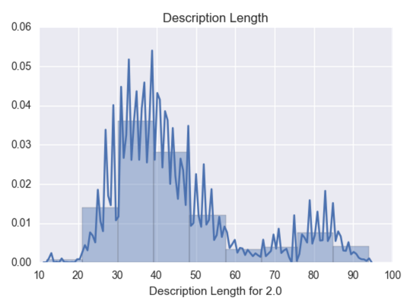
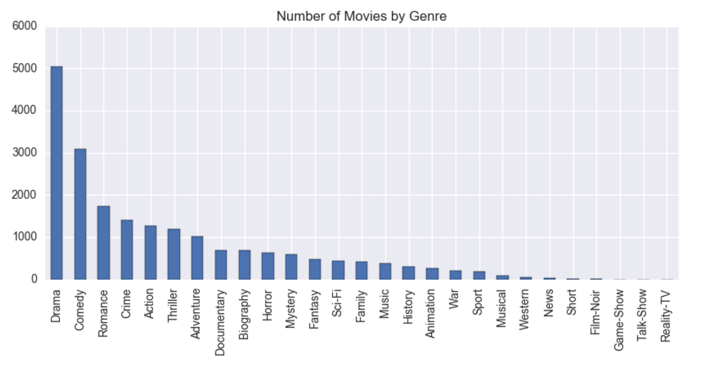
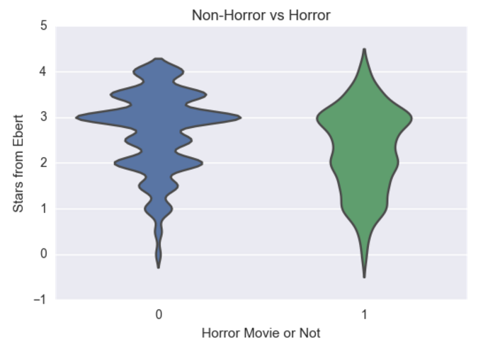
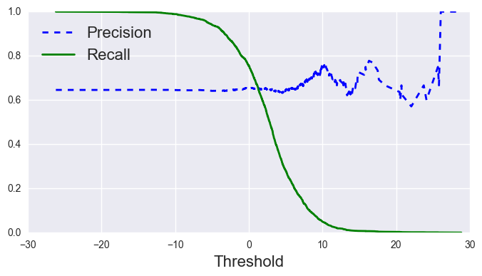
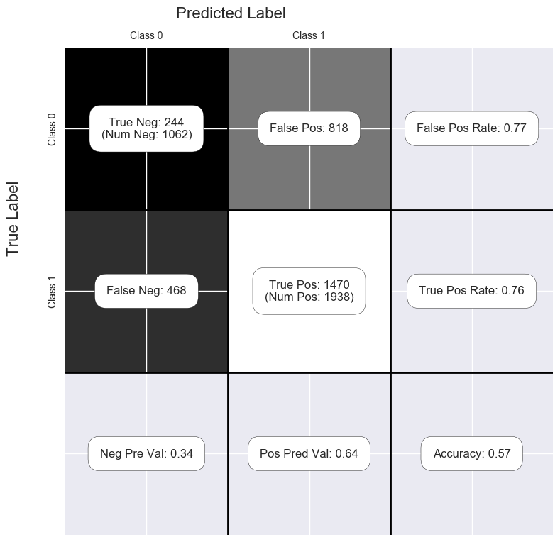

# Classification Project

## Introduction

This is a Classification project done at [K2 Data Science](http://k2datascience.com). I would like to design a machine learning pipeline to model how renowned late movie critic Roger Ebert would review movies today.

With the abundance of data on movies, scripts, reviews, and forums for everyone - critics and general audience to express their opinion on movies - can I try to model Ebert's movie ratings against everyone else's?

So I would like to explore the question: **Can we model the movie preferences of the late Roger Ebert and estimate how he would continue to rate movies today?**

## Challenge

Roger Ebert was a unique movie critic. He did not review like other well-known critics, often went against the grain and had a strong penchant for foreign films. My tastes are starkedly different than his. Ebert's understanding of the cinema domain was extensive. He understands the minutae of themes, plots, acting, cinematography, and orchestral composition.

It will probably be inadequate to model based purely on objective data and numerical features. Generating features that have some leaning toward subjectivity could push the model into stronger predictive territory. Examining the ratings from regular movie goers and other critics could have a strong correlation with Ebert's ratings.

Here is what I have found by reading about Ebert's critical style on [Wikipedia](https://en.wikipedia.org/wiki/Roger_Ebert#Critical_style):

- Ebert once said when questioned “I wrote that review 37 years ago. I am not the same person. I am uninterested in being ‘consistent’”
- Ebert emphasized his star ratings had little meaning if not considered in the context of the review itself. He described his critical approach to films as “relative, not absolute”. He reviewed a film for what he felt it would be to its prospective audience.
- “Ebert’s views could clash with the overall reception of movies, as evidenced by (…)”
- Even though Ebert was described as an agnostic in 2005, “Ebert commented on films using his Catholic upbringing as a point of reference, and was critical of films he believed were grossly ignorant of or insulting Catholicism.
- “Ebert was also and advocate of Asian American cinema.”
- Ebert was accused by some horror movie fans of elitism in his dismissal of what he calls “Dead Teenager Movies”, which he felt consisted of nothing more than groups of teenagers being killed off with the exception of one survivor to populate a sequel.
- “His favorite actor was Robert Mitchum and his favorite actress was Ingrid Bergman. He also considered Buster Keaton, Robert Altman, Weber Herzog and Martin Scorsese to be his favorite directors.”
- “Ebert was an outspoken opponent of the MPAA film rating system, repeatedly criticizing its decisions regarding which movies are suitable for children.”

That showed me that adding genres, actors, directors and maybe a decade classification could be very helpful.

## Data

- 9000+ Roger Ebert movie reviews scraped from his website
  - Reviews have continued since his passing by other critics
- Metacritic scores
- IMDB scores and review counts
- Genres, actors and directors

## Exploratory Data Analysis

After cleaning and organizing the data, I examined the distribution of ratings with a histogram.

These are discrete ratings and there is a definite left skew. It's odd to see that there are higher than average ratings for all movies, but it might be self-selecting. Ebert only chooses movies that are accepted or known to be *good* movies, rather than comic book superhero movies stuffed with CGI.

I then went on to segment univariate and bivariate feature visualizations by each discrete rating value. Here is the normal and log transformed rating count for rating 3.0.

The bivariate analogue of a histogram is known as a “hexbin” plot, because it shows the counts of observations that fall within hexagonal bins. This plot works best with relatively large datasets.

## Feature Engineering

After an inital round of EDA, I went on to engineer novel features from the data set. I thought the following may have some influence on Roger Ebert's ratings:

- Season the movie was released in (ie. Winter)
- Whether a film was foreign (non-english dialogue)
- Ratio of user reviews to critic reviews on IMDB
- Length of movie description on IMDB and review on Ebert's website (in words)

Here is a violin plot that shows the range of ratings by season and the left split is domestic films, while the right split is foreign films. There is definitely more area under the curve for the foreign films on the higher star ratings.

Next we have an examination of word length for descriptions of movies' with star ratings of 2.0. All the other discrete values show the same bimodal distribution.

I also created dummy variables for the following data:

- Genres
- Directors
- Star actors
- Decade

However, I discarded actors and directors that appeared in a single movie in the dataset since they wouldn't have much predictive value. Anyhow, that resulted in a high-dimensional dataset with over 4800 features.

We can also see that Horror movies indeed get lower ratings like we suspected from reading his biography on Wikipedia:

## Modeling

I looped through a variety of classification algorithms: probabilistic, distance, linear model and gradient-boosting. The results were not great and it seemed hard to eek out any solid results.

Here is the confusion matrix from a basic `SGDClassifier`.

## Lessons Learned and Further Research

In the end, the modeling approach performed as well as a dummy classifier that simply picked the most common class. I could definitely shift the threshold in favor of precision, but recall would plummet to 0. In this example, I'd rather watch only good movies and have a few false positives (bad movies recommended), even if that means missing a bunch of good ones. However, in a realistic scenario, an extreme decision approach would not be recommended.

It may be impossible to model Roger Ebert's interpretation of movies. Although many movies are generally accepted as true, there is a fair amount of subjectivity when it comes to critiquing movies. Most likely, I would need to add better features. Off the top of my head, using natural language processing to extract topics, keywords and sentiment could definitely hit at whether the review is positive or negative.

At the same time, I realize that many of the features may not be available at the time of movie release and some of them are available within 2 weeks or even 2 months after the theatrical release. I'd need to narrow down the evaluation metric and features that would be usable if I were to continue working on this project.

## Code Information

Feel free to browse the Jupyter notebooks in this repository. To acquire the data set, follow the docstrings for the scraping functions. I used standard Python packages and visualization libraries. To load the Pickle files you might need to use Pandas version 0.19.x. Pickle files larger than 100mb were not pushed to this repository since GitHub does not support them.
